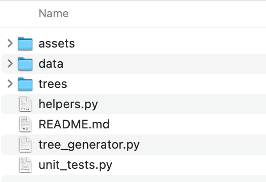

# Attack Tree Generator

## Description

Attack Tree Generator is a CLI-based Python application which generates a visual attack tree from the data provided by the user in .json format. 

The app provides the following features:

- Generate a CLI-based attack tree based on the data provided in a .json file
- Make a risk assessment based on automated calculation of risk values (likelihood of occurrence) 
- Perform an analysis of different sce by changing values 
- Generate a visual attack tree (in .png format) based on the values provided by the user and calculated by the application

## Table of Contents

- [External Libraries and Dependencies](#external-libraries-and-dependencies)
  - [External Libraries](#external-libraries)
  - [Dependencies](#dependencies)
- [Installation](#installation)
- [Usage](#usage)
  - [Leaf values (Likelihood of Occurrence or LOO)](#leaf-values-likelihood-of-occurrence-or-loo)
  - [Overall risk rating and evaluation](#overall-risk-rating-and-evaluation)
- [Features](#features)
- [Contact Information](#contact-information)
- [Tests](#tests)
- [License](#license)
- [References](#references)

## External Libraries and Dependencies

The application relies on a number libraries and have a few dependencies to provide the intended functionalities.

### External Libraries

The application uses the following external libraries:

- anytree (Anytree, N.D.): Provides the basic features for attack trees such as Node class and attack tree representation.
- cmd (Python.org, 2023a): A simple framework for command line-oriented applications.
- json (Python.org, 2023b): A basic .json encoder and decoder for python.
- copy (Python.org, 2023c): Provides deepcopy() function to create a new compound object by recursively cloning child objects of the original.
- time: (Python.org, 2023d): Provides a variety of time-related functions. In the app, only sleep() function is used to the interaction more human-friendly (i.e. by pausing for certain time to allow the user to read the messages displayed).

For unit testing, the following external libraries were used:
- unittest (Python.org, 2023e): Provides the unit testing functionality.
- mock (Foord, 2023): Provides the ability to mock user input or variables for testing purposes.
- os (Python.org, 2023f): Provides the ability to use operating system dependent functionality.

Please follow the links in the references to know more about these external libraries.

### Dependencies

Sole dependency of the application is Graphviz (2023) - an open source graph visualisation software. Please refer to the installation section for details about how to install it.

It should also be noted that the application was written in Python 3.10.5 and it is advised to update the Python version on the client machines if necessary.

## Installation

In order to install and run the application, follow the steps blow:

1. Unzip the application in your preferred directory.
2. Install Graphviz. Please note that, pip install is not sufficient, and it is recommended install Graphviz directly to the system as well. Download it from: https://graphviz.org/download/ The installation has been tested on Mac system, but as pointed out by some users (for example: https://stackoverflow.com/questions/35064304/runtimeerror-make-sure-the-graphviz-executables-are-on-your-systems-path-aft) for Windows some additional configurations might be required, even though it has not been explicitly stated so by Graphviz.
3. Install anytree package by running: 
    ~~~
    pip install anytree
    ~~~
4. Navigate to the project directory where *main.py* resides and run the application in the terminal/console. See Usage section for details.

## Usage

1. The application folder will look like this when you unzipped the project files:
   

   
   Where:
   - **assets**: The folder which contains project-relevant files (screenshots, etc.).
   - **data**: The folder which contains .json files containing attack tree. It contains the default .json file *data.json* which can be modified and additional .json files can be added here.
   - **trees**: This is where the trees (:png files) created by the application will be exported.
   - **helpers.py**: Contains helper functions to provide required functions.
   - **README.md**: Contains information about how the features, installation and usage of the program. (This file!)
   - **tree_generator.py**: This is the main file of the project which contains CLI script. You will use this file to run the application.
   - **unit_tests.py**: Includes a couple of unit tests crafted to verify the functionality of the application.

2. Before running the application, make sure that the .json file containing your attack tree data is in the *data* folder and structured properly or that the default *data.json* file is modified to contain your attack tree data. While .json importer that anytree offers provides a different template, the application offers a customized template which is a simpler and more convenient for inexperienced users. 
   In the .json file, a leaf node looks like this:

    ~~~
    "leaf10": {
    "name": "Brute force",
    "parent": "Denial of service",
    "value":2.0
   }
    ~~~

   Where:
   - ***leaf10***: An ID for the leaf node. It can be anything convenient to you and it has no significance for the application, except for the root node. The ID of the root node should be kept as "root".
   - **name**: The name of the leaf node. It will appear in the attack tree that is generated by the application.
   - **parent**: Parent node of the leaf node in question. Set it to "None" for the root node. Otherwise, it should be populated with the name attribute of the parent node.
   - **value**: The value in a scale of 0-10. See features section to get more information about how to determine the value (so called 'likelihood of occurrence'). NOTE: You should only enter values for the leaves (the bottom of the tree) and leave the other leaf nodes (higher level) as *null*, because of two reasons: (1) The leaves are the only relevant part of the tree which can be assessed accurately and realistically by the risk professionals. (2) It increases efficiency in terms of performance and also allows for more accurate calculations. The value can be floating point or integer, in any case, the application will convert it to floating point.  
   
   To summarize, the **root node** should look like this (only the name can change here):

   ~~~
    "root": {
    "name": "Open Safe",
    "parent": "None",
    "value":null
   }
    ~~~
   A **leaf node** should look like this (value should be set to *null*):

    ~~~
    "leaf1": {
    "name": "Learn Combo",
    "parent": "Open Safe",
    "value":null
   }
    ~~~
   A **leave** (at the bottom of the attack tree) should look like this:

   ~~~
    "leaf10": {
    "name": "Find Written Combo",
    "parent": "Learn Combo",
    "value":5.5
   }
    ~~~
   Please note that only leaves (with no child leaf nodes) are allowed to have a value due to design decision. More information will follow below.

3. Open the terminal, make sure that you are in the folder where you unzipped the application files (navigate to the appropriate folder if needed) and run the following command:
    ~~~
    python3 tree_generator.py
    ~~~
    You can also use your favourite IDE to run the application.

4. Since the project is designed as a CLI-based application, the main menu of the application will be displayed and a command prompt will be strated with following options:

   Where: 

   - **load**: Loads the .json file containing the attack tree. You should start here, and the application will return an error if you try to use other features without loading the tree data to memory first. The application will prompt for a file name (as you can have multiple .json files under *data* folder) and you are required to enter full name including .json extension (e.g. 'attack_tree.json'). If you do not enter a name and hit ENTER, the default .json file (data.json) will be loaded to memory.
   - **generate**: Generates an attack tree to the console based on the values loaded to the memory and the automated calculation. 
   - **calculate**: Calculates the values for the leaf nodes all the way up to the root node using the values provided for the leaves. It is advised to run *calculate* feature to calculate the values for the leaf nodes before generating/visualising the attack tree. Otherwise, the values for the leaf nodes will be displayed as "0.0". Note that the application will calculate the average likelihood of occurrence and will not make probabilistic calculations. 
   - **visualise**: Generates a graphical attack tree in .png format and saves it to the /trees directory.
   - **analyse**: Allows the user to enter/modify the values for the leaves.
   - **help**: Displays help content for a command. Usage: help *command*
   - **exit**: Exits the application

See the **Features** section of this document for details about each of the options listed above. 

### Leaf values (Likelihood of Occurrence or LOO)

Likelihood of Occurrence (LOO) values (on a scale of 0-10) are used to populate the leaf values in the .json document. 

In Special Publication 800-30 Guide for Conducting Risk Assessments, NIST (2012) suggests three assessment scales to assess likelihood of occurrence of threat events:
   - Likelihood of Threat Event Initiation (Adversarial)
   - Likelihood of Threat Event Occurrence (Non-Adversarial)
   - Likelihood of Threat Event Resulting in Adverse Impacts

Since each of the assessment scales are provides a separate scale of 0-10 and 0-100 with semi-quantitative values, three scales were combined into one for simpler use:

It is suggested to use this scale because it will help keep consistency among different risk assessors, however, one can easily assign an overall score based on one's own experience, knowledge or judgement.

For your convenience, you can access the read-only version of the LOO value calculator here: https://bit.ly/loo-calculator

Feel free to make a copy and use.

### Overall risk rating and evaluation

After feeding the application with the LOO values for the leaves, the application calculates an overall risk rating and comes up with an evaluation according to the criteria below:

| **Overall rating** | **Evaluation** |
|:------------------:|:--------------:|
|     10.0 - 9.51    |    Very High   |
|     9.50 - 7.91    |      High      |
|     7.90 - 2.01    |    Moderate    |
|     2.00 - 0.51    |       Low      |
|      0.50 - 0      |    Very Low    |

The evaluation criteria is also derived from NIST's recommendations. Please note that the application rounds the result of the calculation to two decimal places.  

## Features

The features of the application are as follows:
   - Generates CLI-based attack trees from .json documents (as demonstrated in the **Usage** section):

   - Generates a graphical attack tree in .png format. You can create a full attack tree here:

   You can also choose to generate a partial attack tree, starting from a leaf node of your choice:

This may come in handy when your attack tree is too big to visualise appropriately or when you want to focus on a specific part of the tree.
   
   HINT: If the node is: '/Business/Threat_Category/Threat_Name' you should enter Threat_Name to select the node.

   Because the tree is drawn on a grid, it is easier to follow the layout and also observe the difference between the leaf nodes of the same level.

   - Offers the ability to work with various .json files without having to exit the application. You can store your .json files to *data* folder and load them one by one to memory by entering the file name.
   - Calculates the values for the leaf nodes and the overall threat rating based on the user input.

   - Allows the user to enter different values for leaves and conduct an analysis of the potential impact of different scenarios on the business.

## Contact Information

You can contact the developer (Etkin Getir) at eg22518@essex.ac.uk for questions, queries, ideas and contributions. All queries will be responded within 72 hours.

## Tests

Using unittest library, a total of 13 test cases were written for the application.
   - test_no_file: Tries to load a .json file that do not exist and checks if the application returns an error.
   - test_generate_no_file: Tries to generate an attack tree without loading a file to memory and checks if the app returns an error.
   - test_visualise_no_file: Tries to visualise an attack tree without loading a file to memory and checks if the app returns an error.
   - test_visualise_no_node: Tries to visualise an attack tree from a node that do not exist and checks if the app returns an error.
   - test_generate_file: Checks if an attack tree with provided name is created.
   - test_calculate_no_file: Tries to calculate an overall risk value without loading a file and checks if the app returns an error.
   - test_calculate_score: Tries to calculate the overall risk score with the test data and checks if it returns the expected value.
   - test_evaluate_very_low: Tests if the risk score (0.2) returns "VERY LOW" rating.
   - test_evaluate_low: Tests if the risk score (2.0) returns "LOW" rating.
   - test_evaluate_moderate: Tests if the risk score (3.7) returns "MODERATE" rating.
   - test_evaluate_high: Tests if the risk score (8.5) returns "HIGH" rating.
   - test_evaluate_very_high: Tests if the risk score (9.7) returns "VERY HIGH" rating.
   - test_analyse_no_file: Tries to run analyse function without loading a file and checks if the app returns an error.

Test cases can be found in the unit_tests.py file and can be run by running the following command (verbose mode):

    python3 -m unittest -v unit_tests
    

## License

MIT License (MIT)

Copyright (c) 2023 Etkin Getir

Permission is hereby granted, free of charge, to any person obtaining a copy  of this software and associated documentation files (the "Software"), to deal  in the Software without restriction, including without limitation the rights to use, copy, modify, merge, publish, distribute, sublicense, and/or sell copies of the Software, and to permit persons to whom the Software is 
furnished to do so, subject to the following conditions:

The above copyright notice and this permission notice shall be included in all copies or substantial portions of the Software.

THE SOFTWARE IS PROVIDED "AS IS", WITHOUT WARRANTY OF ANY KIND, EXPRESS OR IMPLIED, INCLUDING BUT NOT LIMITED TO THE WARRANTIES OF MERCHANTABILITY,  FITNESS FOR A PARTICULAR PURPOSE AND NONINFRINGEMENT. IN NO EVENT SHALL THE AUTHORS OR COPYRIGHT HOLDERS BE LIABLE FOR ANY CLAIM, DAMAGES OR OTHER
LIABILITY, WHETHER IN AN ACTION OF CONTRACT, TORT OR OTHERWISE, ARISING FROM, OUT OF OR IN CONNECTION WITH THE SOFTWARE OR THE USE OR OTHER DEALINGS IN THE SOFTWARE.

## References

Anytree (N.D.) Any Python Tree Data. Available from: https://anytree.readthedocs.io/en/2.8.0/ [Accessed: 10 April 2023]

Graphviz (2023) Graphviz. Available from: https://graphviz.org [Accessed 10 April 2023]

Foord, M. (2023) Mock - Mocking and Testing Library. Available from: https://mock.readthedocs.io/ [Accessed 17 April 2023]

National Institute of Standards and Technology (2012) *Guide for Conducting Risk Assessments.* Washington D.C.: U.S. Department of Commerce. DOI: https://doi.org/10.6028/NIST.SP.800-30r1   

Python.org (2023) cmd — Support for line-oriented command interpreters. Available from: https://docs.python.org/3/library/cmd.html [Accessed 10 April 2023]

Python.org (2023) copy — Shallow and deep copy operations. Available from: https://docs.python.org/3/library/copy.html [Accessed 10 April 2023]

Python.org (2023) os — Miscellaneous operating system interfaces.    Available from: https://docs.python.org/3/library/os.html [Accessed 17 April 2023] 

Python.org (2023) unittest — Unit testing framework. Available from: https://docs.python.org/3/library/unittest.html [Accessed 17 April 2023]

Python.org (2023) json — JSON encoder and decoder. Available from: https://docs.python.org/3/library/json.html [Accessed 10 April 2023]

Python.org (2023) time — Time access and conversions. Available from: https://docs.python.org/3/library/time.html [Accessed 10 April 2023]